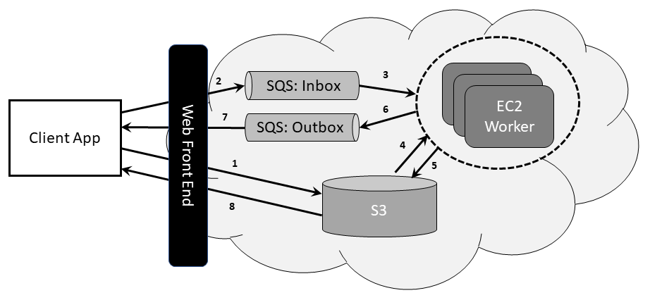

# Cloud Computing Lab 3

## Architecture : 

Two different files are written for the implementation using Java SDK for AWS,

1. Client App
2. EC2 Worker App.

### Q1 : What types of queues can you create? State their differences.

**Solution :**

In Amazon Web Services, we can create two different types of queues. The queues are FIFO queues and the standard queues. In FIFO, as the name suggests
the requests/messages are processed in first in, first out fashion. The send/receive and delete message rate in FIFO queue is 300 request/messages per second.
Such queue is employed for activities where the order of the requests are important to the implementation. Messages in this case are delivered exactly once.

On the other hand, standard queues don't have a limit on the request/message format. They try to keep the order as they came, but are/can be altered by processing methods. Standard queues (also employed in the lab3 project) can be used for batch processing of the tasks, and to allocate the tasks to different worker nodes in the EC2 instances. Messages in this case are delivered atleast once.

### Q2 : In which situations is a Web-Queue-Worker architecture relevant

**Solution :**

As the web-queue-worker architecture provides various benefits such as,

1. Simple and easy architectre to understand.
2. Easy to manage and deploy.
3. Clear seperation of the tasks.
4. The worker and the frontend client app are two different entities and can be modified or scaled independently.

With these benefits, the architecture can be applied into various different aapplications,

1. Applications with a relatively simple domain.
2. Applications with some long-running workflows or batch operations.
3. When we wish to use managed services, rather than using IaaS.
